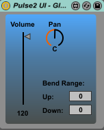

# Modular Pulse 2 UI - Max for Live Plugin

Max for Live Plugin to control the Waldorf Pulse 2 Synthesizer using MIDI CC commands.
The user interface (UI) is built in a modular fashion, allowing to only load the Oscillator or the VCF.

The MIDI CC commands are based on [this reference](https://downloads.waldorfmusic.com/cloud/index.php/s/KzjAwQjrs497BZF) and the [user manual](https://cloud.waldorfmusic.com/index.php/s/jjKoRMjgHNWER72).

Currently, no SysEx messages are supported, however, this will perhaps be added in the future.

## Modules

### OSC

### VCF

### LFO

### ENV

### MOD

### ARP

### Global

## Disclaimer

This product is in no way affiliated with or endorsed by [Waldorf Music](https://waldorfmusic.com).

## License

Pulse 2 UI © 2025 by Lorenz Kapsner is licensed under [Creative Commons Attribution-NonCommercial-ShareAlike 4.0 International](https://creativecommons.org/licenses/by-nc-sa/4.0/?ref=chooser-v1)
